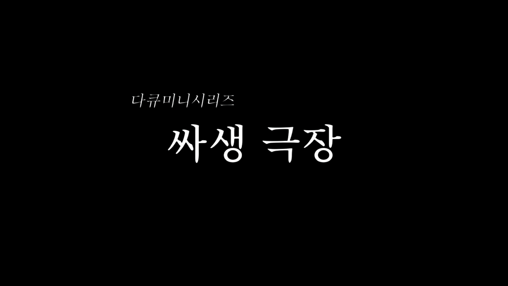

# Coding With Me

## 🗓️프로젝트 개요

- **진행 기간 : 2022.07.08 ~ 2022.08.18 (5주)**
- **목표**
  - 화상 수업, 강사-학생간 코드 전송, 코딩 테스트, 채팅 등 프로그래밍 수업에 필요한 기능들을 한 곳에 모은 프로그래밍 교육 서비스

## 👯팀원 정보 및 업무 분담 내역

김혜린(FE) - UI 설계, UI 디자인, 유저 관련 기능 개발, LMS 기능 개발

## :paperclip: 발표 자료 링크

https://drive.google.com/file/d/18LT0MX8mZmogb03t9eP4HJiSg1luOV0I/view?usp=sharing

## :information_desk_person: 시연 영상

https://drive.google.com/file/d/1k2rmB0Yzx4SGuA6UBA97MS54xq1HDmev/view?usp=sharing

## :video_camera: 광고 영상(링크 추후 추가)

## :computer: 서비스 내용

### 초기 화면

### 학생 관리

### 시험 생성

### 강의 시작

### code 전송

### 코드 받아보기

.gif)

### 시험 응시하기

## :heart_decoration: 회고

### Keep

- Vue3와 Quasar 프레임워크를 채택한 것이 처음에 우리팀 프론트엔드에 큰 부담이었고, 실제로 관련된 기술 학습과 오류 해결에만 초반 2주를 쏟았던 것 같다. 하지만 **조급함을 버리고 표준 기술을 학습해 결국 원하는 기능을 구현하는 끈기**가 우리 프로젝트의 완성도를 끌어올려주었고, **단기간 학습과 구현의 능력**을 끌어올려주는 경험이 되었다.
- **Jira**와 **Mattermost**를 십분 활용해 팀원들과 일정을 공유하여 **투명한 의사소통과 일정관리**를 처음 체험해보았다. 팀원의 상태를 파악하고 문제가 생길 만한 부분은 신속하게 공유함으로써 시간을 효율적으로 활용하고 팀워크를 기를 수 있는 시간이었다.

### Problem

- 기획 단계에서 세부적인 상황까지 의논하지 않았더니, 결국 BE 코드를 여러 번 수정해야 하는 경우가 발생했다. **기획자, FE, BE 간 기획단계에서의 소통**의 중요성을 깨달았고, 누구도 그 과정을 귀찮아하지 않고 미래의 부채를 줄이기 위한 노력을 해야 한다는 것을 느꼈다.

### Try

- 새로운 기술 **React**와 관련 프레임워크 학습하기
- 특화 프로젝트에서 팀장을 맡게 되었기 때문에, 기획 단계에서부터 세부 사항을 모든 팀원이 함께 합의하고, 팀의 원칙을 만들어가야겠다고 생각했다.

## 🖋️git commit message convention

#### 참고

https://blog.ull.im/engineering/2019/03/10/logs-on-git.html

#### Fix

> 올바르지 않은 동작을 고친 경우

#### Add

> 코드나 테스트, 예제, 문서 등의 추가가 있을 때

#### Remove

> 코드의 삭제가 있을 때

#### Refactor

> 전면 수정이 있을 때

#### Simplify

> 복잡한 코드를 단순화 할 때

#### Improve

> 향상이 있을 때(호환성, 테스트 커버리지, 성능, 접근성...)

#### Make

> 기존 동작의 변경을 명시

#### Implement

> 모듈, 클래스 등 구현체를 완성시켰을 때

#### Correct

> 문법의 오류나 타입의 변경, 이름 변경에 사용

#### Ensure

> 무엇인가 확실하게 보장받도록 할 때

#### Prevent

> 특정한 처리를 못하게 막을 때

#### Avoid

> 특정한 상황을 회피할 때

#### Move

> 코드의 이동이 있을 때

#### Rename

> 이름 변경이 있을 때

#### Allow

> 무언가를 허용할 때

#### Verify

> 검증 코드를 넣을 때

#### Set

> 변수 값을 변경하는 등 작은 수정

#### Pass

> 파라미터를 넘기는 처리를 할 때
